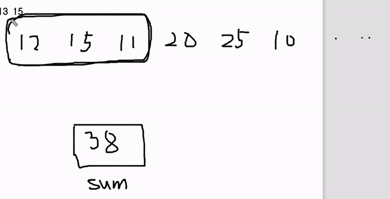

## 인프런 - 자바스크립트 알고리즘 풀이

### **05.** 효율성 - 최대 매출 (Sliding Window)

**> 문제**

현수의 아빠는 제과점을 운영합니다.  
현수 아빠는 현수에게 N일 동안의 매출기록을 주고 연속 된 K일 동안의 최대 매출액이 얼마인지 구하라고 했습니다.  
만약 `N=10`이고 10일 간의 매출기록이 아래와 같습니다.  
이때 `K=3`이면  
`[12, 15, 11, 20, 25, 10, 20, 19, 13, 15]`  
연속된 3일간의 최대 매출액은 **11+20+25=56만원**입니다.  
여러분이 현수를 도와주세요.

- 입력: `3, [12, 15, 11, 20, 25, 10, 20, 19, 13, 15]`
- 출력: `56`

**> 코드**

_ME_  
  [`#일반`, `#알고보면 이중 반복문임`]

```js
function solution(k, arr) {
  let left = 0;
  let right = k;
  let result = Number.MIN_SAFE_INTEGER;
  while (right <= arr.length) {
    const currSum = arr.slice(left, right).reduce((prev, curr) => prev + curr);
    result = Math.max(currSum, result);
    left++;
    right++;
  }
  return result;
}
const a = [12, 15, 11, 20, 25, 10, 20, 19, 13, 15];
console.log(solution(3, a));
```
- 투포인터를 사용하지만 반복문 내에 `reduce` 메서드가 있어 시간복잡도 `O(n²)` 예상..
- 연속된 3일이 되는 모든 경우를 계산하여 3일동안의 매출이 제일 큰 값을 반환하는 코드

_ANSWER_  
  [`#슬라이딩 윈도우`, `#직접 코드보며 동작원리 메모`]

```js
function solution(k, arr) {
  let answer,
    sum = 0;
  for (let i = 0; i < k; i++) sum += arr[i];
  answer = sum;
  for (let i = k; i < arr.length; i++) {
    sum += arr[i] - arr[i - k];
    answer = Math.max(answer, sum);
  }
  return answer;
}

let a = [12, 15, 11, 20, 25, 10, 20, 19, 13, 15];
console.log(solution(3, a));
```
- 모든 매출의 정보가 들어있는 `arr` 배열의 첫번째부터 `k`(세)번째의 날까지의 합(`sum`)을 구함  
  이후, 최종적으로 반환할 변수인 `answer`에 값 대입
- 첫번째 날부터 `k`(세)번째의 날까지의 합만을 구했음. 나머지 데이터도 계산해야 함
  - `sum` 값에 현재 순회하고 있는 값을 더한뒤에, (`sum + arr[i]`)  
    직전에 계산했던 `sum`의 연속된 날짜 데이터의 첫번째 날짜에 있는 값을 빼줌. (`sum + arr[i] - arr[i - k]`)
  - 계속해서 반복하며 `sum`이 `answer`보다 크다면 `answer`의 값은 `sum`으로 업데이트
- 참고 이미지  
  
  <!-- https://user-images.githubusercontent.com/33610315/148042489-db1faa9c-170d-4b40-9e9f-62e4e3255dc7.gif -->