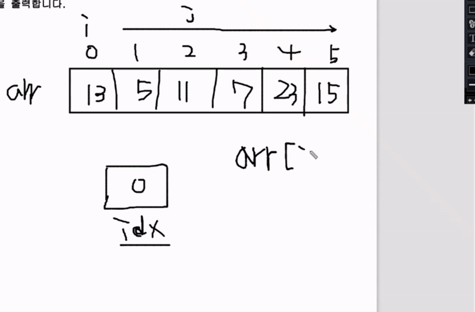

## 인프런 - 자바스크립트 알고리즘 풀이

### **01.** 정렬과 그리디, 결정알고리즘 - 선택 정렬

**> 문제**

N개이 숫자가 입력되면 오름차순으로 정렬하여 출력하는 프로그램을 작성하세요.  
정렬하는 방법은 선택정렬입니다.

- 입력 1: `[13, 5, 11, 7, 23, 15]`
- 출력 1: `[5, 7, 11, 13, 15, 23]`

**> 코드**

_ME_

```js
function solution(arr) {
  for (let i = 0; i < arr.length; i++) {
    let idx = i;
    for (let j = i + 1; j < arr.length; j++) {
      // 이 조건식 반대로하면 내림차순으로 정렬됨
      if (arr[idx] > arr[j]) idx = j;
    }
    [arr[i], arr[idx]] = [arr[idx], arr[i]];
  }
  return arr;
}
console.log(solution([13, 5, 11, 7, 23, 15])); // [5, 7, 11, 13, 15, 23]
```
> 답안 코드와 거의 같음
- 이중 반복문으로 각 값을 체크함
  - 반복문 `i` 시작 시 `i` 값으로 `idx` 변수를 초기화 후 반복문 `j` 순회
    - 반복문 `j`는 `i+1` 위치부터 순회.  
      `arr[idx] > arr[j]` 이 조건에 부합하다면 `idx`를 `j`값으로 업데이트
  - 반복문 `j`를 순회하고 `arr`내에서 `i` 위치에 있는 값과 `idx` 위치에 있는 값을 **swap**


- **참고 이미지**  
  
  <!--  -->

_ANSWER_

```js
function solution(arr) {
  let answer = arr;
  for (let i = 0; i < arr.length; i++) {
    let idx = i;
    for (let j = i + 1; j < arr.length; j++) {
      if (arr[j] < arr[idx]) idx = j;
    }
    [arr[i], arr[idx]] = [arr[idx], arr[i]];
  }
  return answer;
}

let arr = [13, 5, 11, 7, 23, 15];
console.log(solution(arr));
```
