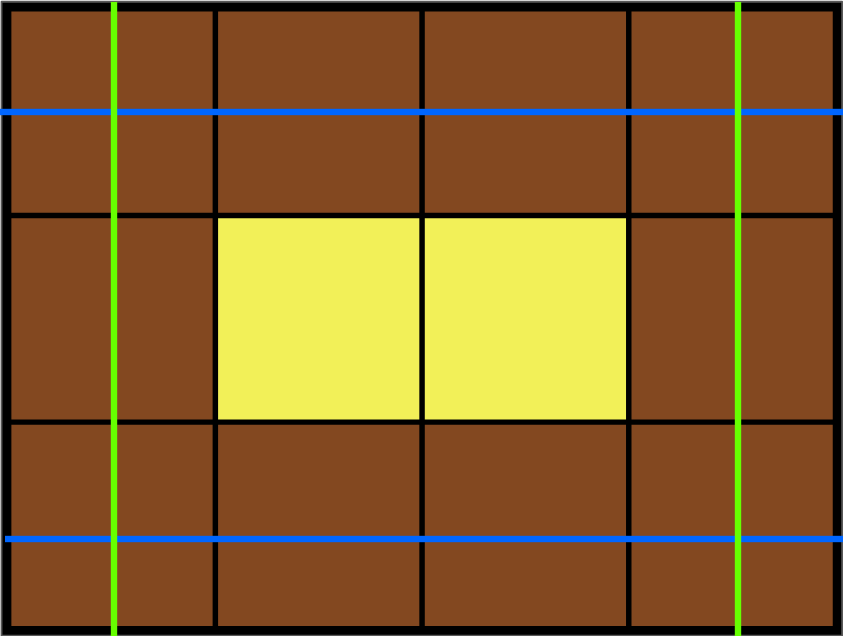

## Programmers - Level2 : 카펫 (42842)

[문제: 프로그래머스 - Level2 : 카펫 (42842)](https://programmers.co.kr/learn/courses/30/lessons/42842)

### [1] 테스트 케이스

```js
const pipeLog = (...funcs) => funcs.forEach((func) => console.log(func));
pipeLog(
  solution(10, 2), // [4, 3]
  solution(8, 1), // [3, 3]
  solution(24, 24), // [8, 6]
);
```

### [2] 코드

**1차시**  
 [**`#통과 실패`**, `#시간초과`]

```js
function createAllCase(brown, yellow) {
  const size = brown + yellow;
  const set = new Set();
  for (let i = 3; i <= size; i++) {
    for (let j = i; j <= size; j++) {
      if (j === size) continue;
      if (j * i === size) set.add([j, i]);
    }
  }
  return [...set];
}

function solution(brown, yellow) {
  const allCase = createAllCase(brown, yellow);
  if (!allCase.length) return [];
  if (allCase.length === 1) return allCase[0];
  for (let i = 0; i < allCase.length; i++) {
    const [col, row] = allCase[i];
    let yellowCnt = yellow;
    Array.from({ length: row }, (_, i) => {
      if (!i || row - 1 === i) return Array.from({ length: col }, () => 'b');
      return Array.from({ length: col }, (_, i) => {
        let str;
        if (!i || col - 1 === i) str = 'b';
        if (!str) yellowCnt--;
        return str;
      });
    });
    if (!yellowCnt) return [col, row];
  }
  return [];
}
```

- 전체 면적 (`size`)가 될 수 있는 모든 경우의 수를 계산한 후  
  직접 2중 배열을 만들어서 yellow 카펫이 들어갈 공간을 계산한 로직
- 이 로직의 경우, 당연히 **_시간 초과_**.

**2차시**  
 [**`#통과 성공`**, `#참고`]

```js
function solution(brown, yellow) {
  const size = brown + yellow;

  // 가로 (col), 세로 (row)
  for (let row = 1; row <= size; row++) {
    const col = Math.floor(size / row);
    if (row > col) continue;
    const yellowCnt = (row - 2) * (col - 2);
    if (yellow === yellowCnt) return [col, row];
  }
  return [];
}
```

> **다음부터 공식 먼저 생각하고 풀기를**

- 가로, 세로의 값을 계산한 뒤에 노란 카펫의 수를 계산하는 로직
- 동작 순서
  - 전체 면적 값 계산 (`yellow + brown`)
  - 반복문
    - 전체 면적 값까지 세로(`row`) 값을 증가 시키며 세로 값 계산
    - 가로(`col`) 값은 `전체 면적 / 세로 값`
    - 세로의 값이 가로보다 클 경우 `continue;`
    - 테두리에 있는 가로 면적을 제외한 값들은 현재 노란 카펫(`yellowCnt`)의 갯수
      - 공식은 `세로 - 2 * 가로 - 2` -> `(row - 2) * (col - 2);`
      - 참고 이미지  
        <br/>
        <!-- https://user-images.githubusercontent.com/33610315/147895745-4b8d1e63-f568-4d8a-8422-8646e96ed5a3.png -->
        - <span><span style="color: lightgreen">연두색 줄</span>: <code>세로 - 2</code></span>
        - <span><span style="color: blue">파란색 줄</span>: <code>가로 - 2</code></span>
    - 만약 매개변수로 주어진 `yellow`와 `yellowCnt`의 값이 같다면 `return [col, row]`

### 참고자료

- [[프로그래머스] [Java] 카펫](https://mozzioi.tistory.com/95)
